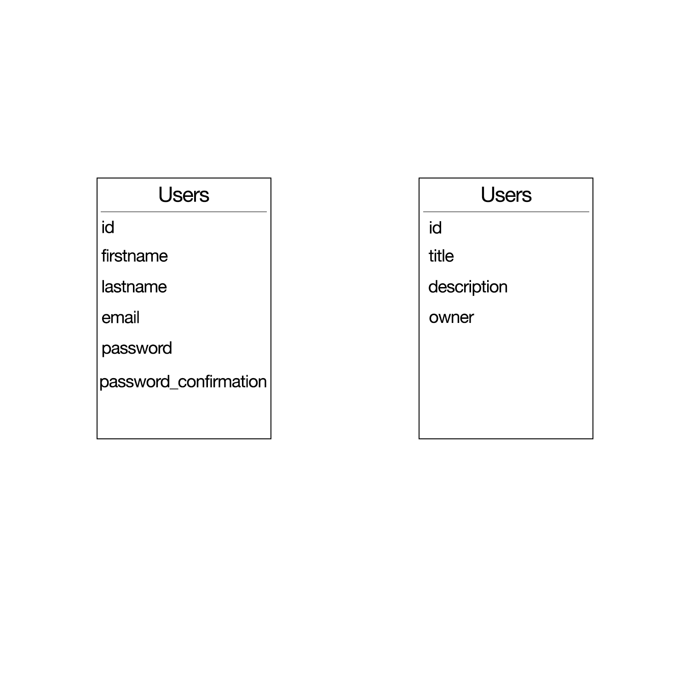
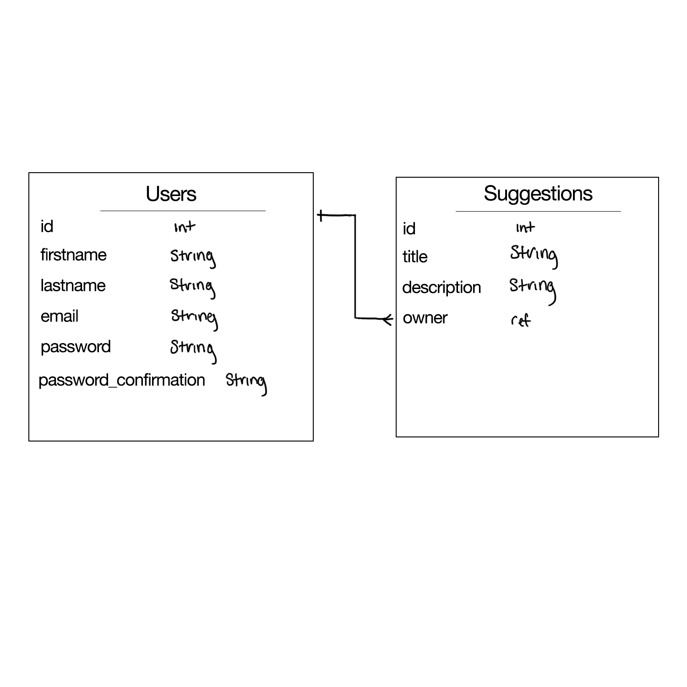

# Reed Creative Werx Portfolio - frontend
GitHub: https://github.com/MDReed2/rcw-portfolio-react
Deployed: https://mdreed2.github.io/rcw-portfolio-react/

# Reed Creative Werx Portfolio - backend
GitHub: https://github.com/MDReed2/rcw-portfolio-backend
Herohu: https://serene-crag-92448.herokuapp.com/

---
## The BackStory
- This project has allowed us to incorporate everything we have learned in this cohort up until now.
- JavaScript and React was implemented on the front-end while using Express Mongo/Mongoose  curl scripts for the back-end.
- The knowledge gained over the last six months has provided me with a vision to create portfolio I would happily provide an URL to companies.
- This portfolio has a backend that allows users to create, read, update, and delete suggestions.

## npm packages used
- npm i react-router-dom

---
## Instructions
MVP User Stories
1. As an unregistered user, I would like to have the option to sign up with First Name, Last Name, email and password to see more information.
2. As a registered user, I would like to sign in with email and password.
3. As a signed in user, I would like to change password.
4. As a signed in user, I would like to sign out.
5. As a signed in user, I would like to add a suggestion.
6. As a signed in user, I would like to update a suggestion.
7. As a signed in user, I would like to delete a suggestion.
8. As a signed in user, I would like to see all my suggestions.
8. As a signed in user, I would like to see all suggestions.
9. As a signed in user, I would like to view a list of other users and view their jobs.

## Improvements
  1. Make navbar more dynamic
  2. Add change password when signed in
  3. Hide all components when suggestion CRUD operation is occurring
  4. Style list of suggestions
  5. Work on logic ti resolve scroll behavior issue in Chrome browser that does not work with react navlinks
  6. Refactor code

## WireFrame
Reed Creative Werx Wireframe 

 1. User must be able to sign-up successfully
 - upon. Clicking sign-up  submit button if successful user will be prompt with sign up message
 - if sign-up failed then user will be prompt with error message

 2. User must be able to sign in successfully
 - once sign-in submit button is clicked user will be prompt with a success or error message
 - user will be directed to the Reed Creative Werx Homepage

 3. User post page
 - user will use nav links to sign-out and change-password
 - user must see fetch, add and delete buttons to interact with the database

4. User will interact with the database
 - user can add a suggestion to the list of suggestions: upon adding a suggestion the user will fill out the suggestion form and submit
 - user submission will be saved into the database
- user will be able to update
 5. User will be able to fetch/get all suggestions
- all suggestions will show at the top of the portfolio
- user can get one suggestion post by the ID

 6. User will be able to delete a post
 - once deleted user should not be able to see it them when fetching the job post.

# Getting Started with Create React App

This project was bootstrapped with [Create React App](https://github.com/facebook/create-react-app).

## Available Scripts

In the project directory, you can run:

### `npm start`

Runs the app in the development mode.\
Open [http://localhost:3000](http://localhost:3000) to view it in your browser.

The page will reload when you make changes.\
You may also see any lint errors in the console.

### `npm test`

Launches the test runner in the interactive watch mode.\
See the section about [running tests](https://facebook.github.io/create-react-app/docs/running-tests) for more information.

### `npm run build`

Builds the app for production to the `build` folder.\
It correctly bundles React in production mode and optimizes the build for the best performance.

The build is minified and the filenames include the hashes.\
Your app is ready to be deployed!

See the section about [deployment](https://facebook.github.io/create-react-app/docs/deployment) for more information.

### `npm run eject`

**Note: this is a one-way operation. Once you `eject`, you can't go back!**

If you aren't satisfied with the build tool and configuration choices, you can `eject` at any time. This command will remove the single build dependency from your project.

Instead, it will copy all the configuration files and the transitive dependencies (webpack, Babel, ESLint, etc) right into your project so you have full control over them. All of the commands except `eject` will still work, but they will point to the copied scripts so you can tweak them. At this point you're on your own.

You don't have to ever use `eject`. The curated feature set is suitable for small and middle deployments, and you shouldn't feel obligated to use this feature. However we understand that this tool wouldn't be useful if you couldn't customize it when you are ready for it.

## Learn More

You can learn more in the [Create React App documentation](https://facebook.github.io/create-react-app/docs/getting-started).

To learn React, check out the [React documentation](https://reactjs.org/).

### Code Splitting

This section has moved here: [https://facebook.github.io/create-react-app/docs/code-splitting](https://facebook.github.io/create-react-app/docs/code-splitting)

### Analyzing the Bundle Size

This section has moved here: [https://facebook.github.io/create-react-app/docs/analyzing-the-bundle-size](https://facebook.github.io/create-react-app/docs/analyzing-the-bundle-size)

### Making a Progressive Web App

This section has moved here: [https://facebook.github.io/create-react-app/docs/making-a-progressive-web-app](https://facebook.github.io/create-react-app/docs/making-a-progressive-web-app)

### Advanced Configuration

This section has moved here: [https://facebook.github.io/create-react-app/docs/advanced-configuration](https://facebook.github.io/create-react-app/docs/advanced-configuration)

### Deployment

This section has moved here: [https://facebook.github.io/create-react-app/docs/deployment](https://facebook.github.io/create-react-app/docs/deployment)

### `npm run build` fails to minify

This section has moved here: [https://facebook.github.io/create-react-app/docs/troubleshooting#npm-run-build-fails-to-minify](https://facebook.github.io/create-react-app/docs/troubleshooting#npm-run-build-fails-to-minify)
